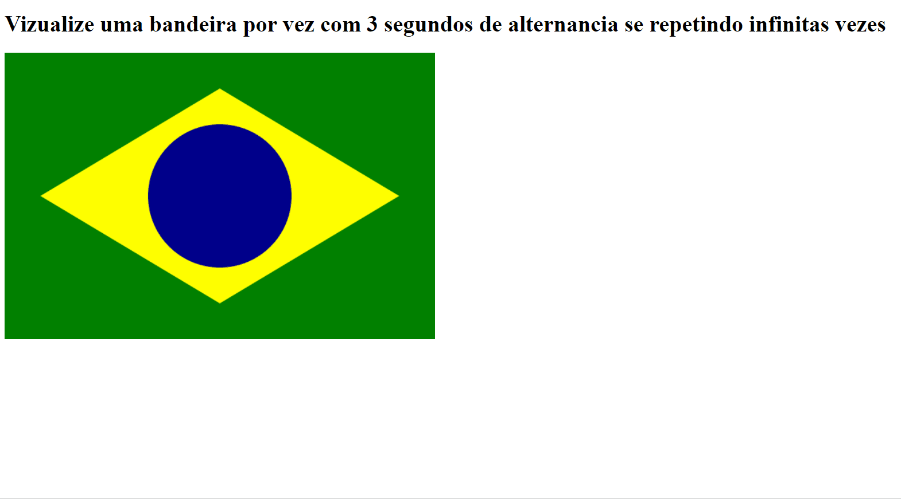

# Exercício para treinar lógica de programação

Exercício desenvolvido no programa One (Oracle Next Education) um programa educacional de tecnologia em parceria com a Alura. 

O objetivo deste projeto é treinar a lógica de programação para seguir o algoritmo de desenho das bandeiras, e depois a sequencia com que alternamos e definimos o intervalo de tempo entre o desaparecimento de uma e aparecimento da outra em um loop infinito.

Serviu muito para me fazer pegar o ritmo da programação e entender como a máquina se comunica e como devo me comunicar com ela, ditando todo o passo a passo com os comandos que quero que ela execute.

É um projeto relativamente simples, mas é o começo de algo grandioso, sigo muito animada e empolgada com cada aprendizado que tenho. Cada dia sabendo um pouco mais que o dia anterior. Gratidão! 💜👩‍💻💻

# Técnologias utilizadas
- HTML
- Javascript 